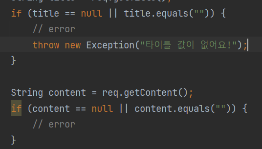
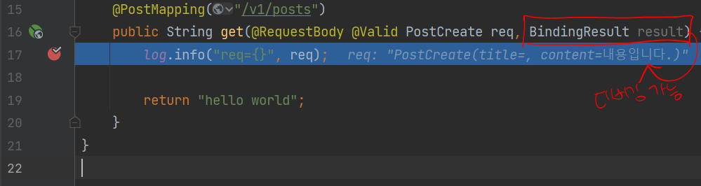
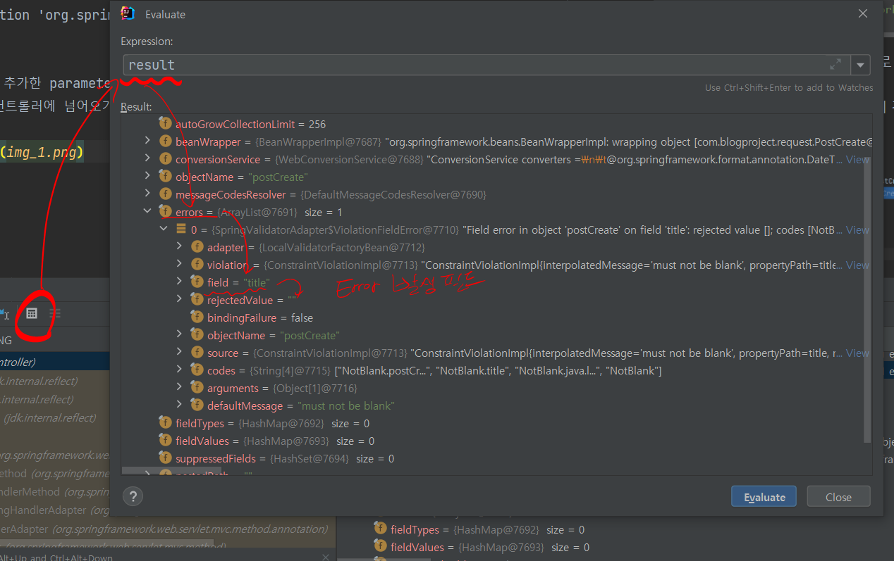

# 23.04.05

* MockMvc의 역할
    * 컨트롤러를 테스트하기 위한 객체
    * 컨트롤러의 동작을 테스트하여 요청을 생성하고 그에 대한 응답을 검증 할 수 있다.


* 컨트롤러 테스트를 하기 위해 @WebMcvTest가 필요한 이유
    * @WebMvcTest가 스프링 컨테이너(Controller를 테스트하기 위해 축소된)를 생성한다.
    * 컨테이너가 MockMvc 객체를 관리한다.


* 성공 테스트의 결과에 대한 Summary 출력 방법
  ```java
  mockMvc.perform(~)
            .andDo(print())
  ```
  
* Content-type 은 <u>헤더에 명시</u>해주어 데이터가 어떠한 형태로 표현되는지 알려준다.
  

* 데이터 검증의 필요성
  1. Client 개발자의 실수로 잘못된 값이 들어올 경우
  2. Client Bug로 값이 누락될 수 있다.
  3. 외부에서 조작된 값을 넣을 수 있다.
  4. DB 저장 시, 의도치 않은 오류
  5. 서버 개발자의 편안함을 위해



* if 문을 통한 검증이 좋지 않은 이유
  1. 검증해야할 것들이 너무 많다.
  2. 누락의 가능성

  * @NotBlank 사용 시 의존성 추가
    ```groovy
    implementation 'org.springframework.boot:spring-boot-starter-validation'
    ```
  
* validation을 추가한 parameter 가 빈값으로 올 경우 디버그해도 못찾는 이유
  * 스프링에서 컨트롤러에 넘어오기전에 검증을 하고 400 에러를 반환
  * 해결법
  
  